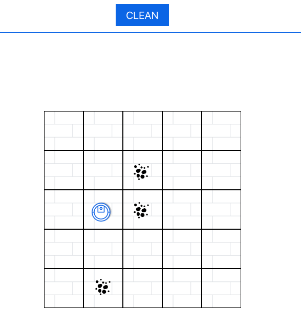

# Hoover the imaginary robot vacuum
A robotic vacuum emulator that is controlled by a set of instructions. Hoover naviates on a grid to collect dirt pieces. The dirt pieces are set to specific X and Y coordinates on the grid when the application starts. Using directions provided hoover moves to a new location and the location coordinates are evaluated against the dirt position. After hoover completes running the final position and total dirt pieces are displayed on the page.

    

Decoupled application that uses a React view and Node server. 

[View a demo of this application on Heroku!](https://hoover-demo.herokuapp.com/)

# Programming challenge:
This program is split out into two services: a React client-facing application that shows the Hoover navigate through the grid, and a Node.js server that reads in the `input.txt` file and sends it to the frontend.

## Design
I decided to create a client facing web application for this challenge because its a fun and interesting challenge but also makes testing the application a lot easier. I used React for rendering the view because this application has a lot of dynamically created/updated properties and react handles this with ease.

I created a server using Node and Express to handle reading the input file because it open the door to more functionality like, uploading / updating instruction files, and storing past cleaning results.

## Assumptions
The following assumptions were made:
- The `input.txt` file is correctly formatted, where the first line contains the grid dimensions, the second line contains the starting coordinates of the Hoover, all subsequent lines are coordinates of dirt, and the last line denotes the directionst hat the Hoover takes.
- The coordinates for the Hoover and the pieces of dirt are all within bounds.
- If the Hoover receives a directional command that is not in `['N', 'E', 'S', 'W']`, the Hoover will stop in its tracks at the current location and error out.
- If a direction attempts to push the Hoover outside of the grid boundaries, the Hoover will hit a wall and will stay in the same place.
- The Hoover only needs to track the number of pieces of dirt that it has picked up, and does not need to track the locations of the dirt it has picked up.
- If the Hoover is starting on a location that also has a piece of dirt, the Hoover will pick up that piece of dirt.

## Challenges
While building this application I came across some interesting problems like creating a math-like grid where the origin (0,0) starts at the bottom left. I found this challenging since a conventional 2D array would usually start at the top left. Using CSS, I was able to rotate the grid 270 degrees, though this brought on its own challenges when referencing the X and Y coordinates, and setting the height/width of the grid so the tiles would be properly aligned. Calculating the "floor" height and width needed to be done dynamically because the grid dimensions change.

## Configuration
The application is separated into two repositories with their own setup instructions.
* [server](https://github.com/AmberLBurroughs/hoover/tree/master/server)
* [view](https://github.com/AmberLBurroughs/hoover/tree/master/view)

## Improvements
Some things I would like to improve about this application:
* Use an API endpoint to update/change/create the instruction settings in either object form or as a file upload.
* Send random hoover instructions each time instead of only reading from a single instruction each time.
* Send cleanup cleanup result to server to be added to a file and read from.
* Better animate the hoover to show it fully moving from position to position (as opposed to it jumping to the center of each square).
* Properly rotating the hoover based on the direction it is attempting to move, showing when it is hitting a wall and is not moving further in a certain direction.
* Coloring tiles which have dirt cleaned up.
* Display more positioning and grid information on the page.
* Allow user to clean again without having a page refresh.
* Make application more responsive.
