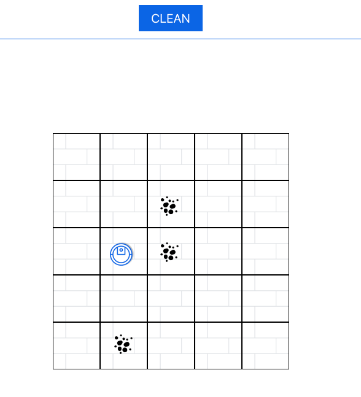
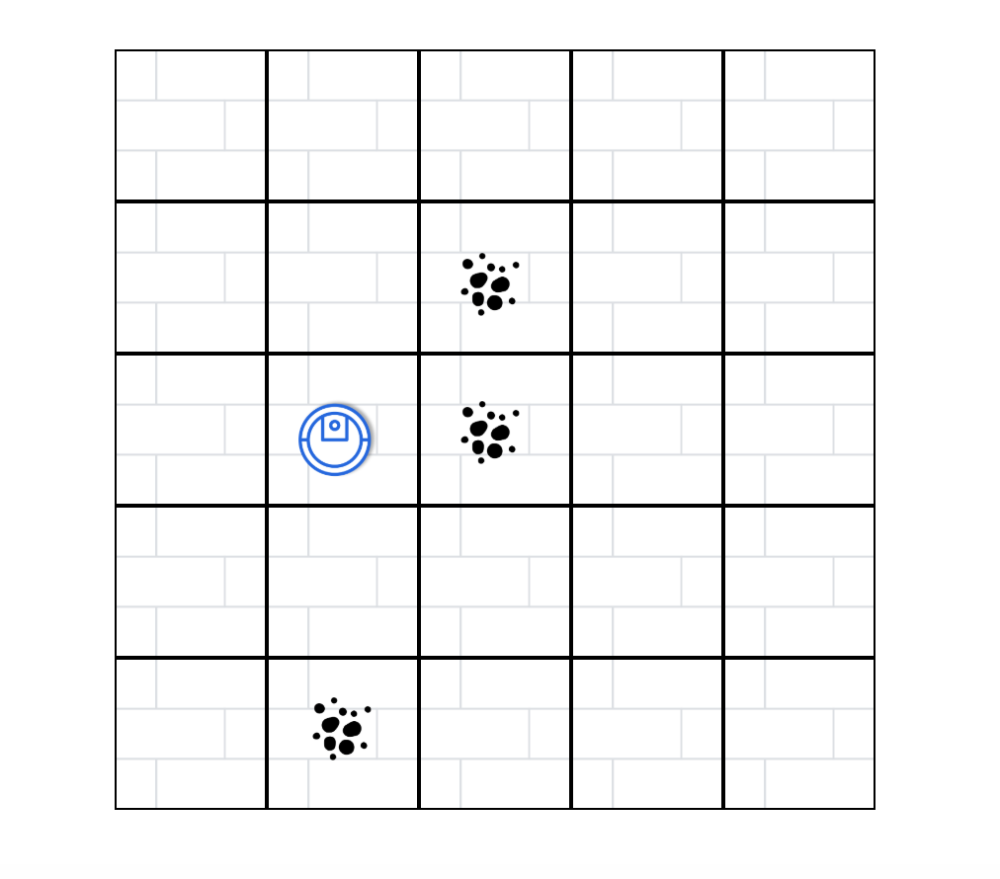

# Hoover the imaginary robot vacuum
A web application that navigates a imaginary robotic hoover through an imaginary room.
<div align="center">
    
</div>
Decoupled application that uses a React view and Node server. 

[Demo](https://hoover-demo.herokuapp.com/)

## Getting Started
These instructions will get you a copy of the project up and running on your local machine for development and testing purposes. 

### Prerequisites
What things you need installed before running this application.

* [NPM](https://docs.npmjs.com/cli/install)
or
* [YARN](https://yarnpkg.com/lang/en/docs/install)
* [The server portion of this application](https://github.com/AmberLBurroughs/hoover/tree/master/server)

### Installing

A step by step series of examples that tell you how to get a development env running

1) Download the client repository to a local machine and open repository in an IDE of choice.

2) Install dependencies & run application
```
# Open a new shell navigate into the client directory
$ yarn install || npm i
# this will install all dependencies for the react portion of this application
# once the installs have completed
$ yarn start  || npm start
# the React application by default will run on PORT 3000
```

## Functionality
#### Get hoover instructions from an endpoint 
Before the first render of `APP` the application makes a request to an end point for hoover instruction. The response is then used to update state, triggering a series of events to occur and the hoover interface to be displayed.

AJAX request for hoover instructions:
```
return fetch("/api/hoover", {
    method: 'GET',
    credentials: 'include',
    mode: 'cors'
});
```
Example hoover instruction object response:
```
{
    dimensions: [5, 5]
    directions: ["N", "N", "E", "S", "E", "E", "S", "W", "N", "W", "W"]
    dirtPos: ["1 0", "2 2", "2 3"]
    startPos: [1, 2]
}
```
#### generate a floor made up by dynamically created tiles
The dementions that are provided in the hoover response instuctions, a floor grid is generated.

Fist the height and width for the board are set with inline CSS. Then the starting is configured. The starting position (0,0) is in the bottom left for this application so the floor is roated 270 degs.  

floor styling:
```
let boardStyle = {
    width: `${(this.state.X_MAX) * 77}px`,
    height: `${(this.state.Y_MAX) * 77}px`
}
```

Next the tiles for the floor are generated by mapping over the tiles array in state.  Tiles is an array which the length is calculated by multiplying the two dimension values provide by the hoover instuction response
`tiles: new Array( y_tiles * x_tiles).fill({ dirt: null })`

tile mapping:
```
{this.props.tiles.map((tile, i) =>
    <Tile
        key={i}
        tile={tile}
        index={i}
        width={this.props.X_MAX}
        height={this.props.Y_MAX}
        onHoverTile={this.props.onHoverTile}
        onHoverOffTile={this.props.onHoverOffTile}
    />
)}
```
#### Sets the hoover's postition
Hoover is positioned on the floor by setting the images absolute positions which are calculated by hoovers current position and the size of the tiles;
```
let hooverStyles = {
    top: `${(this.state.currentPos[0]) * 75}px`,
    left: `${(this.state.currentPos[1]) * 75}px`,
}


```
<div align="center">
    
</div>

#### Moving hoover & collecting dirt
To move hoover around the floor, the array of directions is iterated through.
For each direction, the new position of hoover is determined and set.
A time out in increments of 500ms is used to "animate" hoover's movements on the floor as the current position is updated in the loop.

Iterating over directions array:
```
for (let i = 0; i < moveCount; i++) {
     
    setTimeout(() => { this.setHooverPos(DIRECTIONS[i]); }, 500 * i);
}
```
the current position of hoover is evaluated each time it is set.
If the current position is in the dirt position array, the totalDirt counter is  increment by +1. The that dirt position is removed from the array, so that it can not be cleaned mulitple times.
```
if (dirtPos.includes(currentPosStr)) {
    let index = dirtPos.indexOf(currentPosStr);
    totalDirt = totalDirt + 1;

    dirtPos.splice(index, 1);

    this.setState({
        totalDirt,
        dirtPos
    });
}
```
### Finish Cleaning
Once all the directions have be moved through. the final position of hoover and total dirts cleaned are displayed.
```
{(this.props.finished) ?
    <div>
        <p>Finished cleaning!</p>
        <p>Hoover's Final position (X,Y): {this.props.currentPos[0]},{this.props.currentPos[1]}</p>
        <p>Hoover Picked up: {this.props.totalDirt} pieces of dirt.</p>
    </div>
    :
    ""
}
```
